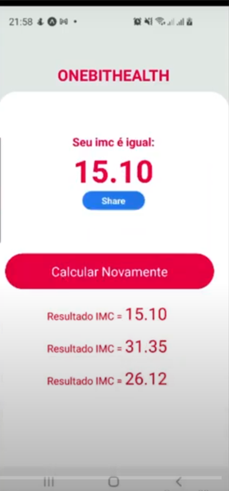

<h1 align="center"> 
  Aplicativo - Cálculo de IMC (Índice de Massa Corporal)
</h1>

## Projeto

 

O projeto desenvolvido foi app de cálculo de IMC (Indice de massa corporal), nome do projeto foi chamado de <em>OneBitHealth</em> , ele permite que o usuário calcule a massa corporal do corpo. O aplicativo foi desenvolvido apenas para práticar e exercitar o uso do React Native.

 

### O que é?
 

O índice de massa corporal é uma medida internacional usada para calcular se uma pessoa está no peso ideal. Wikipédia

 

### Funcionalidades

+ Calcular o índice de massa corporal 
+ Apis React Native usadas:      
  * Vibration (Vibração) 
  * Sharad (Compartilhar nas redes sociais)
  
  
 

### Tecnologias 

Esse projeto foi desenvolvido utilizando:

-  [React Native](https://reactnative.dev/);

 

### License
Esse projeto está sob MIT license. Veja [LICENSE](https://github.com/belapferreira/conceitos-react-native/blob/master/LICENSE) para mais informações.

 

<h3 align="center"> Telas do App </h3> 

 
 

 

 
 

---
<h3 align="center">
 Feito por Márcio Ramos Medeiros - 2022
 </h3>

